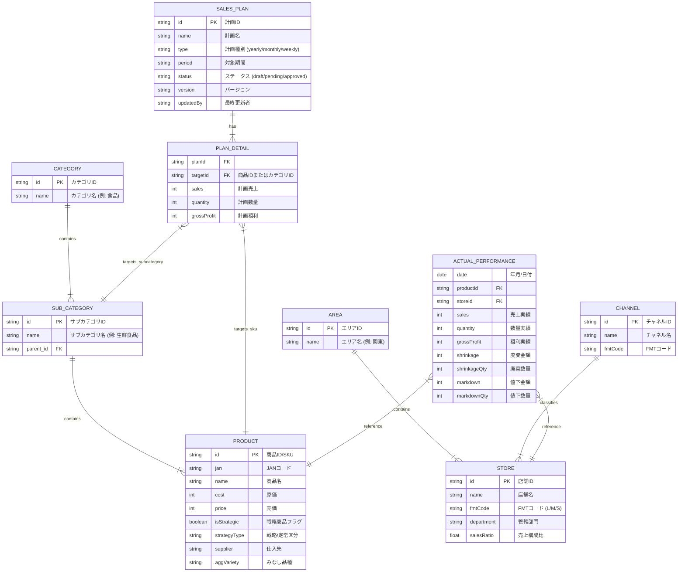

# データモデル設計書

本ドキュメントは、販売計画システムのデータ構造とエンティティ関係（ER図）を定義します。

## 1. 概念ER図 (Mermaid)

## 2. 外部システム連携

システムは以下の外部システムよりデータを取得・同期します。

| システム名 | データ種別 | 連携方向 | 頻度 |
|---|---|---|---|
| **生鮮商談システム** | 原価・売価マスタ | 受信 | 日次 |
| **マスタDB** | 商品階層・店舗マスタ | 受信 | 日次 |
| **実績管理システム** | POS売上・粗利・廃棄・値下 | 受信 | 日次/リアルタイム |
| **一括取込システム** | 外部作成計画データ(Excel/CSV) | 受信 | 随時 |

## 3. データディクショナリ (主なフィールド)

### 商品マスタ (Product)
*   **戦略/定常区分 (`strategyType`)**: 商品が戦略的に売り込む対象か、定番として補充する対象かを区別します。
*   **みなし品種 (`aggVariety`)**: 生鮮品の集計単位（例：牛肉、豚肉）。

### 実績データ (ActualPerformance)
*   **廃棄 (`shrinkage`)**: 商品の廃棄損耗金額。
*   **値下 (`markdown`)**: 売価変更による値下金額。
*   **粗利 (`grossProfit`)**: `売上 - 原価` で算出される利益額。

### 店舗マスタ (Store)
*   **FMTコード (`fmtCode`)**: 店舗の規模や業態を表すフォーマットコード (例: FMT-L=旗艦店)。
